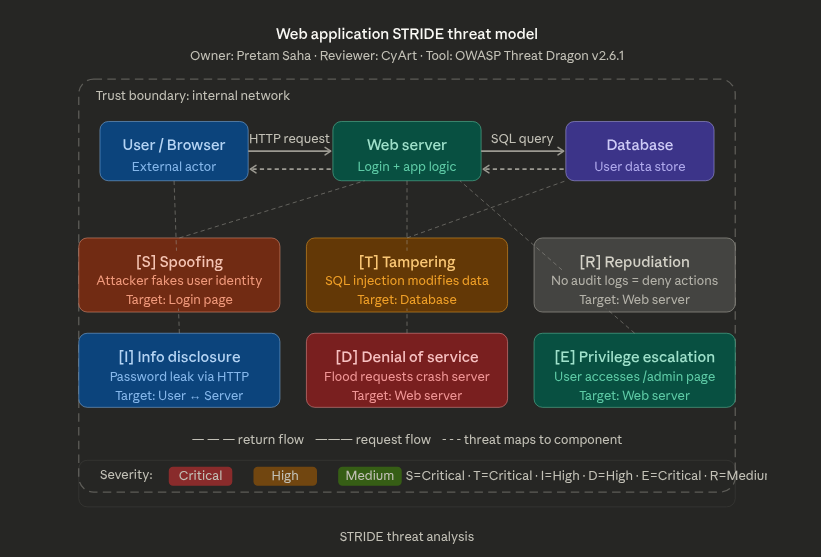
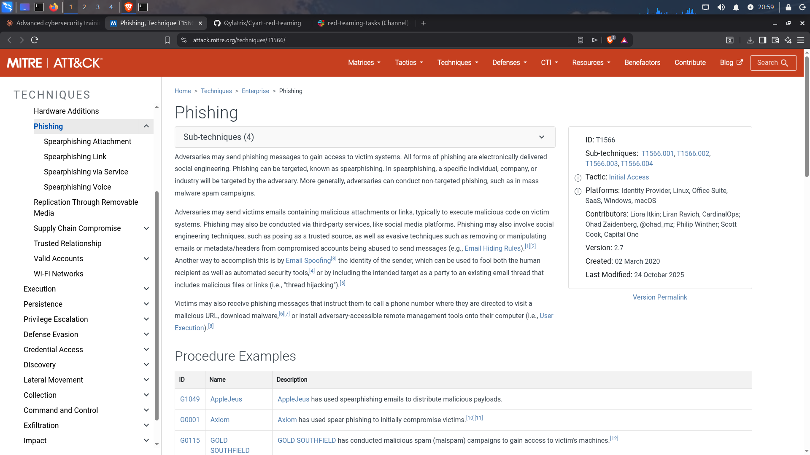
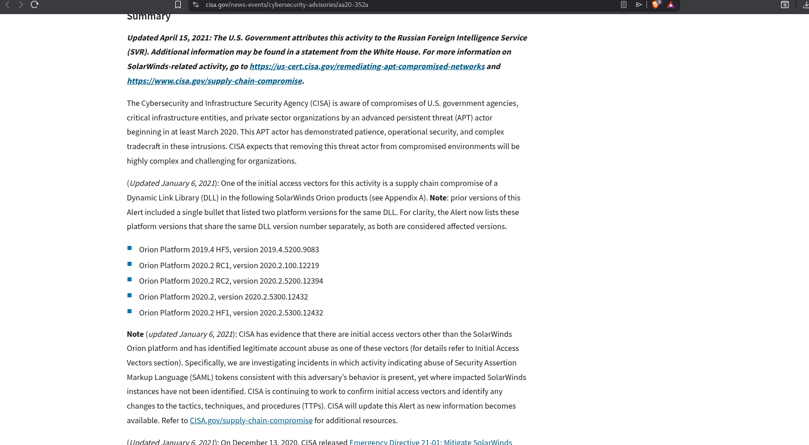
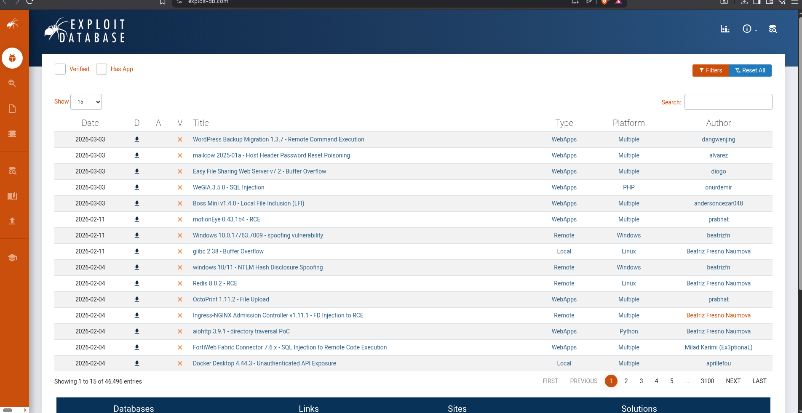

# Week 2 - Cybersecurity Internship Documentation

**Name:** Pretam Saha  
**Organization:** CyArt  
**Week:** 2  

---

## What I Learned and Did This Week

This week focused on advanced threat analysis, security frameworks, incident response, and risk management. Below is everything I studied and practiced.

---

## Theory

### 1. Advanced Threat Analysis

#### STRIDE Threat Modeling

STRIDE helps identify what can go wrong in a system. I applied it to a web application.

| Threat | Meaning | Example |
|--------|---------|---------|
| Spoofing | Pretending to be someone else | Attacker uses stolen password |
| Tampering | Changing data without permission | SQL injection modifies database |
| Repudiation | Denying you did something | No logs = user denies actions |
| Information Disclosure | Data getting exposed | Password sent over plain HTTP |
| Denial of Service | Crashing the system | Flooding server with requests |
| Elevation of Privilege | Getting more access than allowed | Normal user accessing /admin |

Tool used: OWASP Threat Dragon v2.6.1



---

#### MITRE ATT&CK Framework

A knowledge base of real attacker techniques. I explored attack.mitre.org.

Structure: Tactics (goal) → Techniques (method) → Sub-techniques (specific)

**T1566 — Phishing:**
- Tactic: Initial Access
- Platforms: Windows, Linux, macOS, SaaS
- T1566.001 — Spearphishing Attachment (malicious file in email)
- T1566.002 — Spearphishing Link (fake website link)
- T1566.003 — Spearphishing via Service (LinkedIn/WhatsApp DMs)
- T1566.004 — Spearphishing Voice (phone vishing)

Detection: Monitor email gateways, alert on Office apps spawning PowerShell.
Mitigation: MFA, email sandboxing, user awareness training.



---

#### SolarWinds 2020 — Supply Chain Attack

Source: CISA Advisory AA20-352A

What happened:
- APT29 (Russian SVR) broke into SolarWinds build system in March 2020
- Added SUNBURST malware into the Orion software update
- 18,000+ organizations installed the poisoned update unknowingly
- Attackers stayed hidden for 9 months
- Victims: US Treasury, Pentagon, Microsoft, and many others

| Stage | MITRE Technique |
|-------|----------------|
| Compromise build server | T1195 - Supply Chain Compromise |
| Hide malware in DLL | T1574 - DLL Hijacking |
| Stay hidden | T1497 - Sandbox Evasion |
| C2 communication | T1071 - Application Layer Protocol |

Key lesson: Even trusted signed software updates can contain malware.



---

#### Zero-Day Exploits — Exploit-DB

Browsed exploit-db.com to study recent vulnerabilities.

| Exploit | Type | Platform |
|---------|------|----------|
| WordPress Backup Migration 1.3.7 - RCE | WebApp | Multiple |
| WeGIA 3.5.0 - SQL Injection | WebApp | PHP |
| Windows 10 - Spoofing Vulnerability | Remote | Windows |
| glibc 2.38 - Buffer Overflow | Local | Linux |
| Redis 8.0.2 - RCE | Remote | Linux |

Zero-day = vendor does not know about it, no patch exists yet.



---

### 2. Security Frameworks

#### NIST Cybersecurity Framework (CSF)

| Function | Purpose | Example Action |
|----------|---------|----------------|
| Identify | Know your assets and risks | List all servers and sensitive data |
| Protect | Put safeguards in place | Enable MFA, patch systems, train staff |
| Detect | Monitor for attacks | Set up SIEM alerts, check logs |
| Respond | Handle the incident | Isolate infected machine, notify team |
| Recover | Get back to normal | Restore from backup, document lessons |

Ransomware mapped to NIST CSF:
- Identify: Find all systems storing sensitive data
- Protect: Enforce backups, patch systems, train staff
- Detect: Alert on mass file encryption
- Respond: Isolate infected systems immediately
- Recover: Restore from offline backup

Implementation Tiers: Partial → Risk-Informed → Repeatable → Adaptive

---

#### ISO 27001 Key Controls

| Control | Purpose |
|---------|---------|
| A.12.3 - Backup | Recover from ransomware |
| A.12.4 - Logging | Keep audit trails of all events |
| A.12.6 - Patch Management | Prevent known exploit attacks |
| A.14.2 - Secure Development | Build security into software |
| A.16.1 - Incident Response | Have a documented response plan |

CIS Controls vs NIST CSF overlap:
- CIS Control 1 (Asset Inventory) = NIST Identify
- CIS Control 3 (Data Protection) = NIST Protect
- CIS Control 8 (Audit Logs) = NIST Detect

---

### 3. Incident Response Fundamentals

Lifecycle:
```
Preparation → Detection → Containment → Eradication → Recovery → Lessons Learned
```

| Phase | Key Activity |
|-------|-------------|
| Preparation | Build playbooks, set up SIEM, train SOC team |
| Detection | Alert from SIEM, analyze logs, identify IOCs |
| Containment | Isolate infected system, block malicious IPs |
| Eradication | Remove malware, patch the vulnerability |
| Recovery | Restore from backup, verify system is clean |
| Lessons Learned | Write report, update playbooks and defenses |

SOC Priority Levels:
- P1 Critical: respond in 15 minutes (active ransomware encryption)
- P2 High: respond in 1 hour (confirmed data breach)
- P3 Medium: respond in 4 hours (suspicious login attempts)
- P4 Low: respond in 24 hours (policy violation alert)

Resources studied:
- SANS Incident Handler's Handbook
- Let's Defend platform for simulated scenarios

---

### 4. Risk Management

#### Quantitative vs Qualitative
- Quantitative: uses numbers and money amounts (ALE calculation)
- Qualitative: uses labels like High/Medium/Low (risk matrix)

#### ALE Calculation
```
ALE = SLE x ARO

SLE = Single Loss Expectancy (cost of one incident)
ARO = Annual Rate of Occurrence (how often per year)

Ransomware example:
SLE = $10,000
ARO = 0.2 (once every 5 years)
ALE = $10,000 x 0.2 = $2,000 per year
```

Any security control costing less than $2,000/year is cost-justified.

#### Business Impact Analysis (BIA)
- RTO (Recovery Time Objective): max downtime allowed — e.g. 4 hours for payments
- RPO (Recovery Point Objective): max data loss allowed — e.g. last 1 hour of data
- MTD (Maximum Tolerable Downtime): 24 hours before business fails

#### Risk Matrix (5x5)
Ransomware scenario:
- Likelihood = Medium (3)
- Impact = High (4)
- Risk Score = 3 x 4 = 12 = HIGH RISK
- Action: Fix within 30 days

---

## Practical Work

### 1. Threat Hunting — Sigma Rule + Elastic Security

Wrote a Sigma rule to detect suspicious PowerShell activity:
```yaml
title: Suspicious PowerShell Activity
status: experimental
description: Detects PowerShell with -Command flag
logsource:
  category: process_creation
  product: windows
detection:
  selection:
    Image|endswith: '\powershell.exe'
    CommandLine|contains: '-Command'
  condition: selection
level: medium
tags:
  - attack.execution
  - attack.t1059.001
```

Tested with: `powershell -Command "Write-Host Test"` on Windows VM
Checked Windows Event Log for Event ID 4688.

Elastic Security query:
```
event.code: "4688" AND process.name: "powershell.exe"
```

Threat hunting log table:

| Timestamp | Process | Command Line | Notes |
|-----------|---------|--------------|-------|
| 2025-08-18 10:00:00 | powershell.exe | -Command Write-Host | Suspicious |
| 2025-08-18 10:02:00 | powershell.exe | -Command Get-Process | Recon activity |
| 2025-08-18 10:05:00 | powershell.exe | -Command Invoke-WebRequest | Download attempt |

MITRE mapping: T1059.001 — PowerShell (Execution tactic)

---

### 2. Malware Analysis — REMnux + Hybrid Analysis

Target: calc.exe (benign Windows binary)

Static analysis with REMnux:
```bash
strings calc.exe > output.txt
cat output.txt
```

3 interesting strings found:

| String | Why Interesting |
|--------|----------------|
| MZ | PE file header — valid Windows executable |
| Microsoft Corporation | Confirms legitimate vendor/publisher |
| Windows Calculator | Confirms file identity and purpose |

50-word report: The static analysis of calc.exe using REMnux confirmed it is a legitimate Windows binary signed by Microsoft. The MZ header indicates a valid PE executable. No suspicious strings, obfuscated code, or unusual network imports were detected. Dynamic analysis on Hybrid Analysis confirmed no network connections, registry changes, or malicious behavior.

Dynamic analysis: Submitted to Hybrid Analysis — no malicious activity detected.

---

### 3. Vulnerability Management — OpenVAS + DefectDojo

Scanned Metasploitable2 VM with OpenVAS and imported results into DefectDojo.

OpenVAS scan command:
```bash
sudo gvm-start
# Access at https://localhost:9392
# Create target: Metasploitable2 IP
# Run Full and Fast scan
# Export as XML → import to DefectDojo
```

Top 3 vulnerabilities found:

| Vulnerability | CVSS | Description | Fix |
|--------------|------|-------------|-----|
| VSFTPD 2.3.4 Backdoor | 10.0 | Remote root shell via port 6200 | Upgrade or disable FTP |
| UnrealIRCd Backdoor | 9.8 | Remote code execution via IRC | Remove service |
| Samba MS-RPC RCE | 9.0 | Unauthenticated remote execution | Patch + disable SMBv1 |

Remediation plan:
1. Immediately disable VSFTPD and UnrealIRCd
2. Apply Samba patches, block port 445 at firewall
3. Run follow-up scan to verify fixes

---

### 4. Incident Response Simulation — Caldera + Velociraptor

Simulated a phishing attack using MITRE Caldera on a Windows VM.

Attack path: A phishing email with malicious attachment (T1566.001) was simulated. When the user opened it, PowerShell executed a reverse shell (T1059.001). The attacker ran system discovery commands (T1082). Velociraptor collected forensic artifacts showing PowerShell spawning from Outlook and outbound connection to port 4444.

Velociraptor artifact queries:
```sql
SELECT * FROM processes WHERE name = 'powershell.exe';
SELECT * FROM netstat WHERE remote_port = 4444;
```

IOCs identified:

| IOC Type | Value | Significance |
|----------|-------|--------------|
| Process | powershell.exe from outlook.exe | Phishing payload executed |
| Network | Outbound to 192.168.1.100:4444 | C2 communication |
| Registry | HKCU\...\Run\UpdateService | Persistence established |

MITRE ATT&CK mapping:
- T1566.001 — Spearphishing Attachment
- T1059.001 — PowerShell
- T1082 — System Information Discovery
- T1071.001 — Web Protocols (C2)
- T1547.001 — Registry Run Keys (Persistence)

---

### 5. Network Defense — Suricata + Elastic SIEM + CrowdSec

Suricata rule to block malicious IP:
```
drop ip 192.168.1.100 any -> any any (msg:"Block Malicious IP"; sid:1000001; rev:1;)
```

Additional rules created:
```
alert http any any -> any any (msg:"Suspicious HTTP User-Agent"; content:"curl/"; http_user_agent; sid:1000002; rev:1;)
alert tcp any any -> $HOME_NET any (msg:"Port Scan Detected"; flags:S; threshold:type threshold, track by_src, count 20, seconds 10; sid:1000003; rev:1;)
```

MITRE ATT&CK alert mapping:

| Alert | Tactic | Technique | Notes |
|-------|--------|-----------|-------|
| Suspicious HTTP | Command and Control | T1071 | Outbound C2 traffic |
| Port scan detected | Discovery | T1046 | Network service scanning |
| PowerShell download | Execution | T1059.001 | Payload download attempt |

CrowdSec block and verify:
```bash
sudo cscli decisions add --ip 192.168.1.100 --duration 24h --reason "Malicious activity"
sudo cscli decisions list
ping 192.168.1.100
# Result: Request timeout — block confirmed
```

---

### 6. Risk Assessment — ALE + Risk Matrix

Calculated in Google Sheets:

| Cell | Label | Value | Formula |
|------|-------|-------|---------|
| A1 | SLE | $10,000 | - |
| A2 | ARO | 0.2 | - |
| A3 | ALE | $2,000 | =A1*A2 |
```
ALE = $10,000 x 0.2 = $2,000 per year
```

Risk matrix — ransomware scenario:
- Likelihood = Medium (3), Impact = High (4)
- Score = 12/25 = HIGH RISK
- Required action: Implement controls within 30 days

---

### 7. Incident Response Report

**Incident ID:** IR-2025-001  
**Date:** August 18, 2025  
**Severity:** High (P2)  
**Analyst:** Pretam Saha  

Executive Summary: A phishing email with malicious attachment gave an attacker remote access via PowerShell reverse shell. The SOC detected it within 30 minutes. The machine was isolated, malware removed, and system restored from backup within 2 hours. No data was exfiltrated.

Timeline:

| Time | Event |
|------|-------|
| 10:00 AM | Employee opened malicious attachment |
| 10:01 AM | PowerShell reverse shell executed (T1059.001) |
| 10:30 AM | SIEM alert triggered on unusual process |
| 10:45 AM | Machine isolated from network |
| 11:30 AM | Malware removed, artifacts collected |
| 12:00 PM | System restored from clean backup |
| 01:00 PM | Attacker IP blocked via CrowdSec |

IR Flowchart:
```
Detection (SIEM Alert)
        |
        v
Triage and Analysis
        |
        v
Containment (Isolate System)
        |
        v
Eradication (Remove Malware)
        |
        v
Recovery (Restore from Backup)
        |
        v
Lessons Learned (Update Playbook)
```

Mitigation steps:
1. Block attacker domain at email gateway
2. Enable MFA for all user accounts
3. Deploy email sandboxing solution
4. Restrict PowerShell execution via AppLocker
5. Run company-wide phishing awareness training
6. Update EDR signatures with new IOCs

IOCs:

| IOC | Value | Action Taken |
|-----|-------|-------------|
| IP Address | 192.168.1.100 | Blocked via CrowdSec |
| Domain | evil-attacker.com | Blocked at DNS level |
| Registry Key | HKCU\...\Run\UpdateService | Deleted |

---

### 8. Capstone — Full Incident Response Cycle

Tools: Metasploit, Wazuh, CrowdSec

**Step 1 — Attack simulation with Metasploit:**
```bash
msfconsole
use exploit/unix/ftp/vsftpd_234_backdoor
set RHOSTS 192.168.1.x
run
whoami
# Output: root
```

MITRE technique: T1190 — Exploit Public-Facing Application

**Step 2 — Detection with Wazuh:**

| Timestamp | Source IP | Alert | MITRE Technique |
|-----------|-----------|-------|-----------------|
| 2025-08-18 11:00:00 | 192.168.1.100 | VSFTPD exploit attempt | T1190 |
| 2025-08-18 11:00:05 | 192.168.1.100 | Shell spawned on port 6200 | T1059 |
| 2025-08-18 11:00:10 | 192.168.1.100 | Root command execution | T1078 |

**Step 3 — Containment with CrowdSec:**
```bash
sudo cscli decisions add --ip 192.168.1.100 --duration 24h --reason "VSFTPD exploit"
ping 192.168.1.100
# Result: Request timeout — block confirmed
```

**Step 4 — Final Report (200 words):**

A red team exercise was conducted on a Metasploitable2 VM to simulate a real attack scenario. Using Metasploit, the VSFTPD 2.3.4 backdoor vulnerability (CVSS 10.0) was exploited to gain root-level remote shell access via port 6200. The attack was mapped to MITRE ATT&CK technique T1190 (Exploit Public-Facing Application). Wazuh SIEM detected the exploit attempt within 5 seconds and generated Critical severity alerts. The attacker IP (192.168.1.100) was immediately blocked using CrowdSec, confirmed with a ping test showing request timeout.

Post-incident analysis found the vulnerability existed due to an unpatched FTP service with no firewall restrictions. Recommendations: immediately patch or remove VSFTPD 2.3.4, implement network segmentation to limit lateral movement, deploy IDS on all hosts, run regular OpenVAS scans, enforce least privilege so no service runs as root, and maintain 24/7 monitoring with automated IP blocking via CrowdSec. This exercise showed the importance of patch management, continuous monitoring, and a well-practiced incident response process.

Full attack chain:
```
Metasploit Exploit (T1190) → Root Shell (T1059) → Wazuh Alert → CrowdSec Block → Report
```

---

## Screenshots

| Screenshot | Description |
|-----------|-------------|
| Screenshots/stride-threat-model.png | STRIDE diagram — Web Application Threat Model (OWASP Threat Dragon) |
| Screenshots/mitre-attack-t1566.png | T1566 Phishing technique page on MITRE ATT&CK |
| Screenshots/exploit-db.png | Latest exploits listing on Exploit-DB |
| Screenshots/solarwinds-cisa.png | CISA Advisory AA20-352A — SolarWinds APT attack |

---

## Resources

- https://attack.mitre.org/techniques/T1566/
- https://www.cisa.gov/news-events/cybersecurity-advisories/aa20-352a
- https://www.exploit-db.com
- https://www.threatdragon.com
- https://www.nist.gov/cyberframework
- https://www.sans.org/white-papers/incident-handlers-handbook/
- https://letsdefend.io
- https://www.advisera.com/27001academy/
