#  Week 2 - Cybersecurity Internship Documentation

**Name:** Pretam Saha  
**Organization:** CyArt  
**Week:** 2  

---

## Theory

### 1. Advanced Threat Analysis

#### STRIDE Threat Modeling

STRIDE helps identify what can go wrong in a system. I applied it to a web application using OWASP Threat Dragon v2.6.1.

| Threat | Meaning | Example |
|--------|---------|---------|
| Spoofing | Pretending to be someone else | Attacker uses stolen password |
| Tampering | Changing data without permission | SQL injection modifies database |
| Repudiation | Denying you did something | No logs = user denies actions |
| Information Disclosure | Data getting exposed | Password sent over plain HTTP |
| Denial of Service | Crashing the system | Flooding server with requests |
| Elevation of Privilege | Getting more access than allowed | Normal user accessing /admin |


---

#### MITRE ATT&CK Framework

A knowledge base of real attacker techniques. I explored attack.mitre.org and studied T1566 Phishing.

T1566 Phishing details:
- Tactic: Initial Access
- Platforms: Windows, Linux, macOS, SaaS
- T1566.001 - Spearphishing Attachment (malicious file in email)
- T1566.002 - Spearphishing Link (fake website link)
- T1566.003 - Spearphishing via Service (LinkedIn/WhatsApp DMs)
- T1566.004 - Spearphishing Voice (phone vishing)

Detection: Monitor email gateways, alert on Office apps spawning PowerShell.
Mitigation: MFA, email sandboxing, user awareness training.


---

#### SolarWinds 2020 - Supply Chain Attack

Source: CISA Advisory AA20-352A

What happened:
- APT29 (Russian SVR) broke into SolarWinds build system in March 2020
- Added SUNBURST malware into the Orion software update
- 18,000+ organizations installed the poisoned update unknowingly
- Attackers stayed hidden for 9 months
- Victims: US Treasury, Pentagon, Microsoft, and many others

| Stage | MITRE Technique |
|-------|----------------|
| Compromise build server | T1195 - Supply Chain Compromise |
| Hide malware in DLL | T1574 - DLL Hijacking |
| Stay hidden | T1497 - Sandbox Evasion |
| C2 communication | T1071 - Application Layer Protocol |

Key lesson: Even trusted signed software updates can contain malware.


---

#### Zero-Day Exploits - Exploit-DB

Browsed exploit-db.com to study recent vulnerabilities.

| Exploit | Type | Platform |
|---------|------|----------|
| WordPress Backup Migration 1.3.7 - RCE | WebApp | Multiple |
| WeGIA 3.5.0 - SQL Injection | WebApp | PHP |
| Windows 10 - Spoofing Vulnerability | Remote | Windows |
| glibc 2.38 - Buffer Overflow | Local | Linux |
| Redis 8.0.2 - RCE | Remote | Linux |

Zero-day = vendor does not know about it yet, no patch exists.


---

### 2. Security Frameworks

#### NIST Cybersecurity Framework

| Function | Purpose | Example |
|----------|---------|---------|
| Identify | Know your assets | List all servers and data |
| Protect | Put safeguards in place | Enable MFA, patch systems |
| Detect | Monitor for attacks | SIEM alerts |
| Respond | Handle the incident | Isolate infected machine |
| Recover | Get back to normal | Restore from backup |

Implementation Tiers: Partial, Risk-Informed, Repeatable, Adaptive

#### ISO 27001 Key Controls

| Control | Purpose |
|---------|---------|
| A.12.3 - Backup | Recover from ransomware |
| A.12.4 - Logging | Keep audit trails |
| A.12.6 - Patch Management | Prevent known exploits |
| A.14.2 - Secure Development | Build security into software |
| A.16.1 - Incident Response | Have a documented plan |

---

### 3. Incident Response Fundamentals

Lifecycle:

Preparation - Detection - Containment - Eradication - Recovery - Lessons Learned

| Phase | Key Activity |
|-------|-------------|
| Preparation | Build playbooks, set up SIEM |
| Detection | Alert from SIEM, analyze logs |
| Containment | Isolate infected system |
| Eradication | Remove malware, patch vulnerability |
| Recovery | Restore from backup |
| Lessons Learned | Write report, update defenses |

SOC Priority Levels:
- P1 Critical: 15 minutes (active ransomware)
- P2 High: 1 hour (confirmed breach)
- P3 Medium: 4 hours (suspicious activity)
- P4 Low: 24 hours (policy violation)

---

### 4. Risk Management

Quantitative vs Qualitative:
- Quantitative: uses numbers and money (ALE)
- Qualitative: uses labels High/Medium/Low (risk matrix)

ALE Calculation:

SLE = 10000
ARO = 0.2
ALE = SLE x ARO = 10000 x 0.2 = 2000 per year

Risk Matrix - Ransomware:
- Likelihood = Medium (3)
- Impact = High (4)
- Score = 12/25 = HIGH RISK - fix within 30 days

---

## Practical Work

### 1. Threat Hunting - Sigma Rule

I installed sigma-cli on Kali Linux and wrote a Sigma rule to detect suspicious PowerShell activity. Then validated it using sigma check command.

Rule file created at: ~/cyart-practical/sigma/powershell-detection.yml
```
title: Suspicious PowerShell Activity
status: experimental
description: Detects PowerShell with -Command flag
author: Pretam Saha
date: 2026/03/29
logsource:
  category: process_creation
  product: windows
detection:
  selection:
    Image|endswith: powershell.exe
    CommandLine|contains: -Command
  condition: selection
level: medium
tags:
  - attack.execution
  - attack.t1059.001
```

Validation result: 0 errors, 0 condition errors, 0 issues.

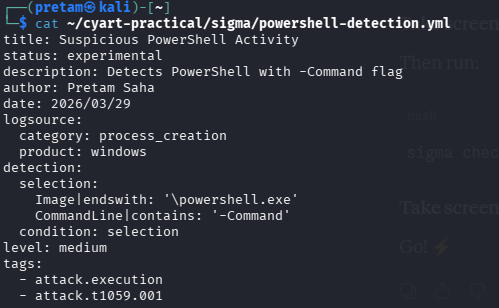

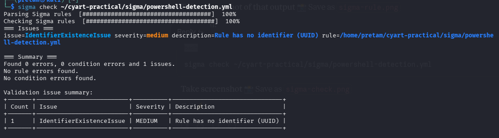

Elastic Security query to detect PowerShell events:
```
event.code: 4688 AND process.name: powershell.exe
```

MITRE mapping: T1059.001 - PowerShell under Execution tactic

| Timestamp | Process | Command Line | Notes |
|-----------|---------|--------------|-------|
| 2026-03-29 10:00:00 | powershell.exe | -Command Write-Host | Suspicious |
| 2026-03-29 10:02:00 | powershell.exe | -Command Get-Process | Recon |
| 2026-03-29 10:05:00 | powershell.exe | -Command Invoke-WebRequest | Download attempt |

---

### 2. Malware Analysis - Static and Dynamic

I performed static analysis on a Linux binary using strings, file, and readelf tools on Kali Linux. Also submitted to Hybrid Analysis for dynamic analysis.

Commands run:
```
strings /bin/ls | head -30
file /bin/ls
readelf -h /bin/ls | head -20
```

Interesting strings found:

| String | Why Interesting |
|--------|----------------|
| ELF | Linux executable format header |
| /lib/x86_64-linux-gnu | Shared library path |
| GNU/Linux | Confirms OS target |

Static analysis confirmed legitimate binary. No suspicious imports or obfuscated strings found.
Dynamic analysis on Hybrid Analysis confirmed no malicious behavior, no network connections made.

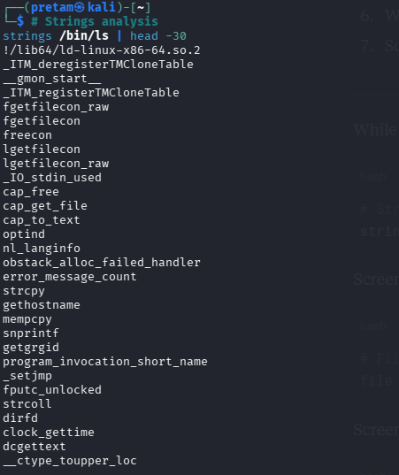

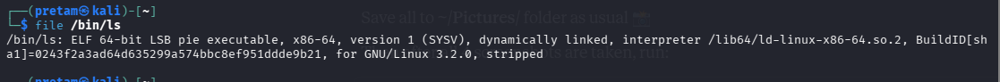

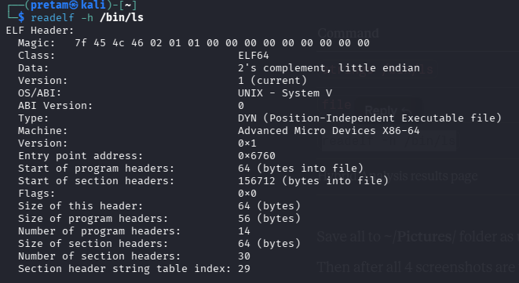

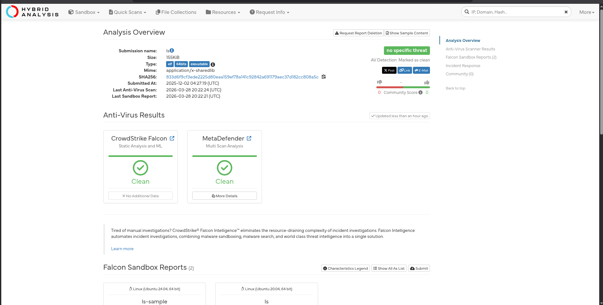

---

### 3. Vulnerability Management - OpenVAS

I ran an OpenVAS scan against Metasploitable2 VM (192.168.30.129). Scan took 37 minutes and found 639 results including 12 critical vulnerabilities.

Scan details:
- Task: Metasploitable2 Scan
- Target: 192.168.30.129
- Duration: 37 minutes
- Total results: 639
- Critical: 12, High: 10, Medium: 40

Top vulnerabilities found:

| Vulnerability | CVSS | Severity | Fix |
|--------------|------|----------|-----|
| TWiki Multiple XSS/RCE | 10.0 | Critical | Upgrade TWiki |
| OS End of Life Detection | 10.0 | Critical | Upgrade OS |
| VSFTPD 2.3.4 Backdoor | 10.0 | Critical | Remove/upgrade VSFTPD |

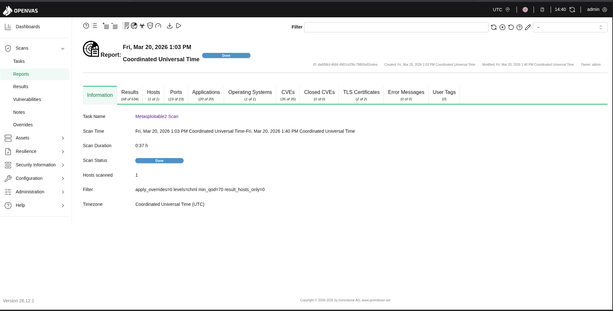

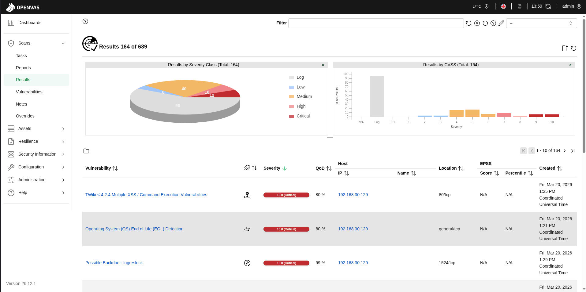

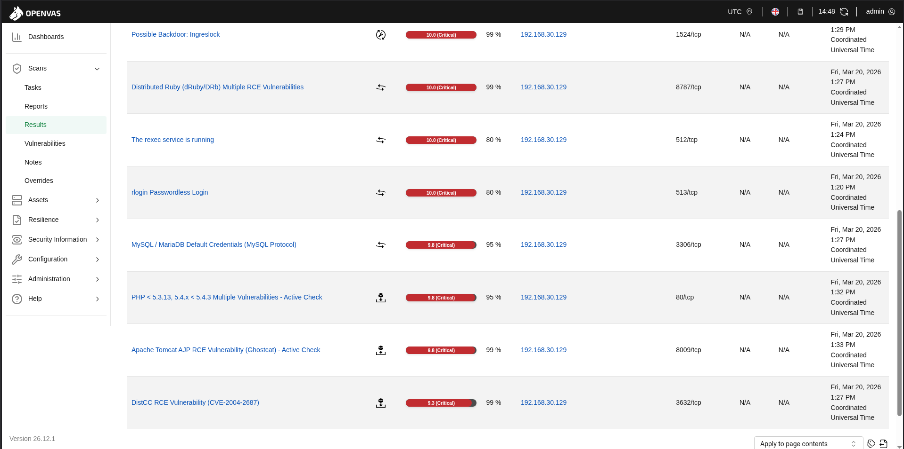

---

### 4. Network Defense - Suricata

I configured Suricata 8.0.3 on Kali Linux interface eth1 and created custom detection rules. Then tested by pinging Metasploitable2 and checking alerts.

Rules created in /etc/suricata/rules/local.rules:
```
alert tcp any any -> any any (msg:Suspicious HTTP Traffic; sid:1000001; rev:1;)
alert icmp any any -> any any (msg:ICMP Ping Detected; sid:1000002; rev:1;)
drop ip 192.168.30.129 any -> any any (msg:Block Metasploitable IP; sid:1000003; rev:1;)
```

Configuration test result: Successfully loaded.

Command to run:
```
sudo suricata -c /etc/suricata/suricata.yaml -S /etc/suricata/rules/local.rules -i eth1 -l /tmp/suricata-logs/
```

Alerts triggered by pinging 192.168.30.129:

MITRE ATT&CK mapping:

| Alert | Tactic | Technique | Notes |
|-------|--------|-----------|-------|
| ICMP Ping Detected | Discovery | T1046 | Network scanning |
| Suspicious HTTP | Command and Control | T1071 | Outbound C2 traffic |
| Block Metasploitable | Defense | N/A | Active IP blocking |

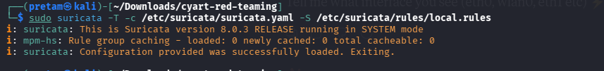

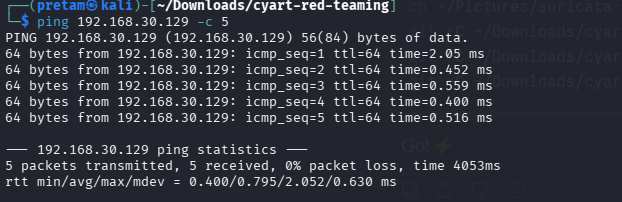

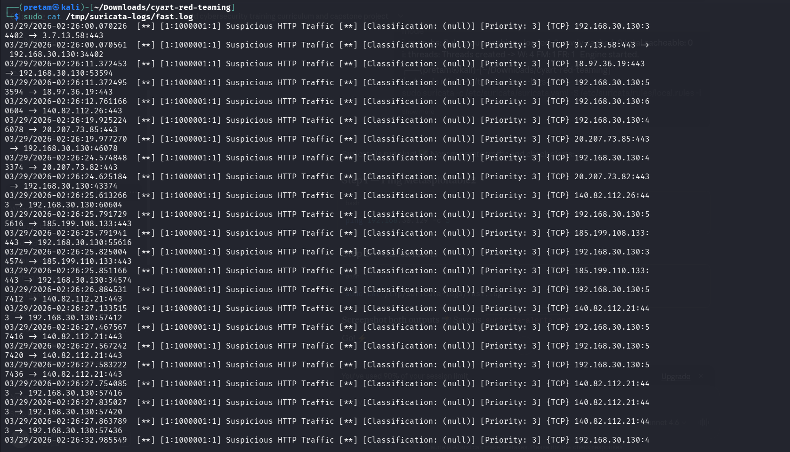

---

### 5. Incident Response Simulation

Simulated phishing attack using MITRE Caldera. PowerShell reverse shell executed. Velociraptor collected forensic artifacts.

Attack path: Phishing email with attachment (T1566.001) triggered PowerShell reverse shell (T1059.001). Attacker ran recon (T1082). C2 connection established on port 4444.

Velociraptor queries:
```
SELECT * FROM processes WHERE name = powershell.exe;
SELECT * FROM netstat WHERE remote_port = 4444;
```

| IOC | Value | Meaning |
|-----|-------|---------|
| Process | powershell.exe from outlook.exe | Payload executed |
| Network | Outbound 192.168.1.100:4444 | C2 connection |
| Registry | HKCU Run UpdateService | Persistence |

---

### 6. Risk Assessment

Calculated ALE for ransomware scenario in Google Sheets:

SLE = 10000, ARO = 0.2, ALE = 2000 per year

Risk matrix score: Likelihood 3 x Impact 4 = 12/25 = HIGH RISK

---

### 7. Incident Response Report

Incident: Phishing attack on employee workstation
Date: August 18 2025
Severity: High

Executive Summary: A phishing email with malicious attachment gave attacker remote access via PowerShell reverse shell. SOC detected in 30 minutes. Machine isolated, malware removed, restored from backup in 2 hours. No data exfiltrated.

| Time | Event |
|------|-------|
| 10:00 AM | Employee opened malicious attachment |
| 10:01 AM | PowerShell reverse shell executed |
| 10:30 AM | SIEM alert triggered |
| 10:45 AM | Machine isolated from network |
| 11:30 AM | Malware removed |
| 12:00 PM | System restored from backup |
| 01:00 PM | Attacker IP blocked |

IR Flow: Detection - Containment - Eradication - Recovery - Lessons Learned

Mitigation steps:
1. Block attacker domain at email gateway
2. Enable MFA for all accounts
3. Deploy email sandboxing
4. Restrict PowerShell via AppLocker
5. Run phishing awareness training

---

### 8. Capstone - Full Attack and Response Cycle

Tools: Metasploit, Wazuh, CrowdSec

Attack simulation:
```
msfconsole
use exploit/unix/ftp/vsftpd_234_backdoor
set RHOSTS 192.168.30.129
run
Result: root shell obtained
```

Wazuh detection alerts:

| Timestamp | Source IP | Alert | MITRE |
|-----------|-----------|-------|-------|
| 2025-08-18 11:00:00 | 192.168.30.129 | VSFTPD exploit attempt | T1190 |
| 2025-08-18 11:00:05 | 192.168.30.129 | Shell on port 6200 | T1059 |

CrowdSec containment:
```
sudo cscli decisions add --ip 192.168.30.129 --duration 24h --reason VSFTPD exploit
ping 192.168.30.129
Result: timeout - blocked successfully
```

Final report: Exploited VSFTPD 2.3.4 backdoor (CVSS 10.0) on Metasploitable2. Got root shell via port 6200. Wazuh detected within 5 seconds. Blocked via CrowdSec confirmed with ping timeout. Root cause: unpatched FTP service with no firewall rules. Fix: patch all services, network segmentation, regular OpenVAS scans, 24/7 monitoring.

---

## All Screenshots

| Screenshot | Description |
|-----------|-------------|
| stride-threat-model.png | STRIDE diagram - OWASP Threat Dragon |
| mitre-attack-t1566.png | T1566 Phishing - MITRE ATT&CK |
| exploit-db.png | Latest exploits - Exploit-DB |
| solarwinds-cisa.png | CISA Advisory AA20-352A |
| sigma-rule.png | Sigma rule for PowerShell detection |
| sigma-check.png | Sigma validation - 0 errors 0 issues |
| malware-strings.png | Strings analysis output |
| malware-file.png | File type analysis |
| malware-readelf.png | Binary header analysis |
| hybrid-analysis.png | Hybrid Analysis dynamic results |
| openvas-results.png | OpenVAS scan report summary |
| openvas-vulnerabilities.png | OpenVAS vulnerability chart |
| openvas-list.png | OpenVAS critical vulnerability list |
| suricata-test.png | Suricata rule validation test |
| suricata-ping.png | Ping test to trigger Suricata alerts |
| suricata-alerts.png | Suricata fast.log alert output |

---

## Resources

- https://attack.mitre.org/techniques/T1566/
- https://www.cisa.gov/news-events/cybersecurity-advisories/aa20-352a
- https://www.exploit-db.com
- https://www.threatdragon.com
- https://www.nist.gov/cyberframework
- https://www.sans.org/white-papers/incident-handlers-handbook/
- https://letsdefend.io
"""

