cd ~/cyart-red-teaming/Week-1 && cat > README.md <<'EOF'
# Week 1 — Red Teaming Live Lab Evidence

## CYART TECH LLP | RED TEAMING | TASK 06

**Intern:** Pretam Saha  
**Date:** March 23, 2026  
**Target IP:** 192.168.30.129 (Metasploitable 2 — VMware)  
**Attacker IP:** 192.168.30.128 (Kali Linux)  
**Environment:** Isolated VMware Lab

---

## Executive Summary

This report documents a complete red team engagement conducted in a controlled lab environment against Metasploitable 2. The assessment demonstrates the full attack lifecycle from reconnaissance to exploitation, credential attacks, malware testing, and defensive mapping.

### Highlights

- 23 open ports discovered
- 3 separate root shell paths obtained
- 12 Critical vulnerabilities identified by OpenVAS
- Passwords cracked using John the Ripper
- Successful Hydra credential validation
- Malware sample detection tested via EICAR

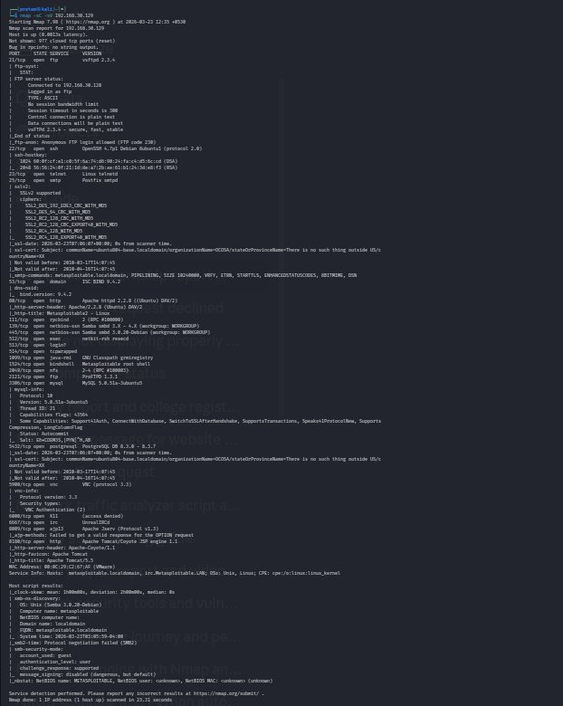

---

# Task 1 — Network Scanning (Nmap)

## Command Executed

nmap -sC -sV 192.168.30.129

## Key Findings

- 23 open ports discovered
- vsftpd 2.3.4 detected
- Samba 3.0.20 identified
- Apache 2.2.8 present
- UnrealIRCd backdoor service exposed
- Root shell service detected on port 1524
- SMB signing disabled
- Anonymous FTP enabled

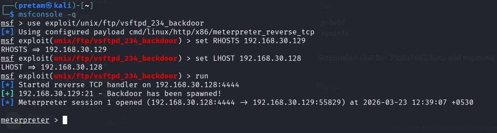

---

# Task 2 — Exploitation (Metasploit)

## 2.1 vsftpd 2.3.4 Backdoor Exploit

The vulnerable vsftpd service was exploited using the Metasploit backdoor module.

use exploit/unix/ftp/vsftpd_234_backdoor  
set RHOSTS 192.168.30.129  
run

Meterpreter session successfully opened.

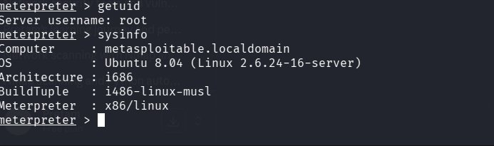

## 2.2 Samba usermap_script RCE

The Samba vulnerability was exploited to gain root shell access.

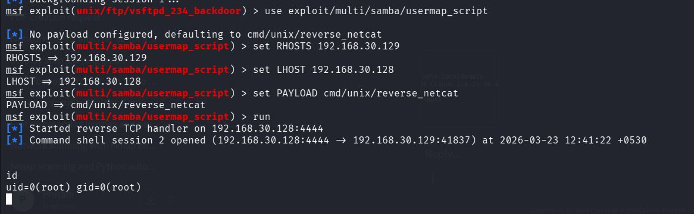

## 2.3 Direct Root Shell

nc 192.168.30.129 1524

Immediate root shell access gained.

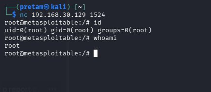

---

# Task 3 — Post Exploitation & Password Cracking

Hashes were extracted from /etc/shadow and cracked offline using John the Ripper.

## Cracked Credential

service : service

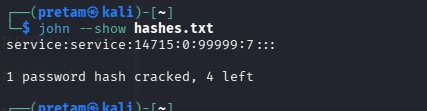

---

# Task 4 — Password Security Testing

## Hydra Online Brute Force

FTP credentials validated successfully.

msfadmin : msfadmin

## KeePassXC Secure Vault

Strong passwords generated and stored.

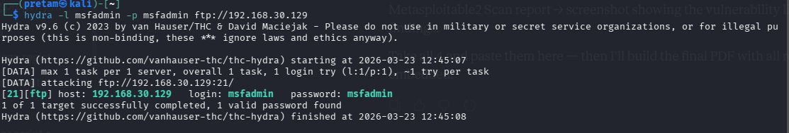

---

# Task 5 — Malware Analysis (EICAR)

The standard EICAR antivirus test file was uploaded to VirusTotal and Hybrid Analysis.

## VirusTotal Result

- Detected by 67+ engines

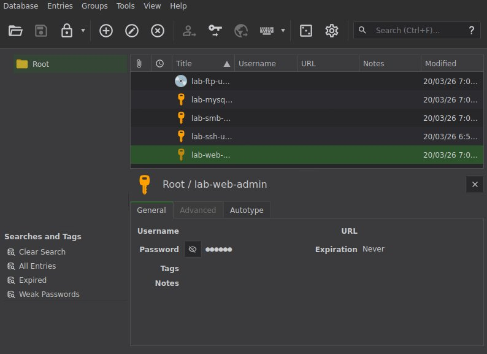

## Hybrid Analysis Result

- Threat Score: 100/100
- No active runtime behavior

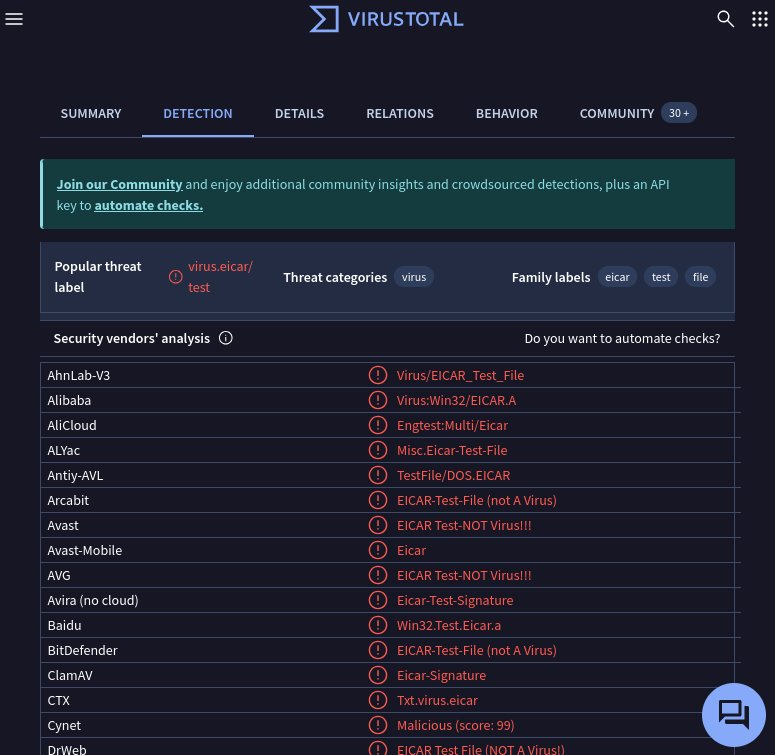

---

# Task 6 — Vulnerability Scanning (OpenVAS)

A full vulnerability scan was executed.

## Dashboard Summary

- 12 Critical
- 10 High
- 40 Medium
- 35 CVEs
- 19 vulnerable services

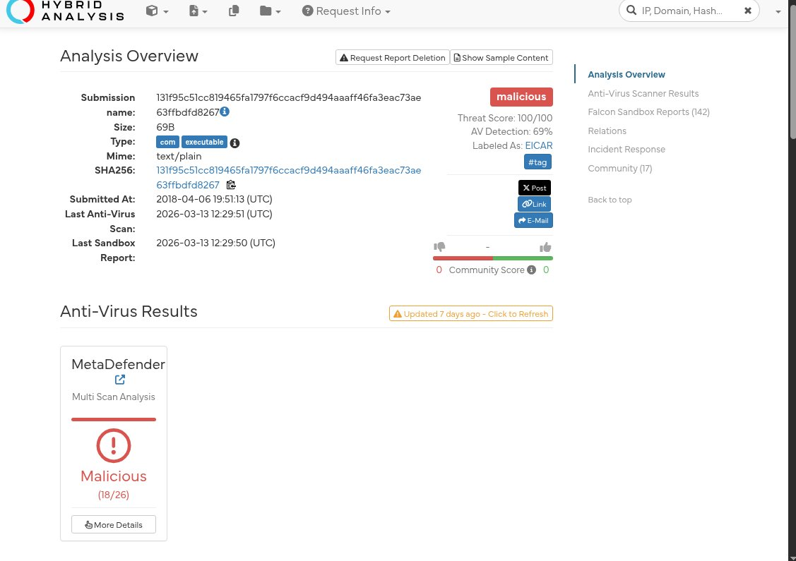

## Severity by Port

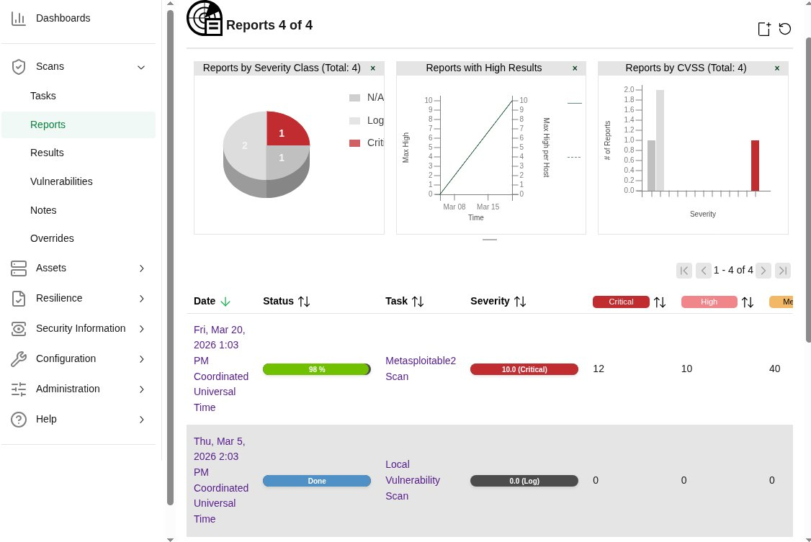

## Full Findings Page

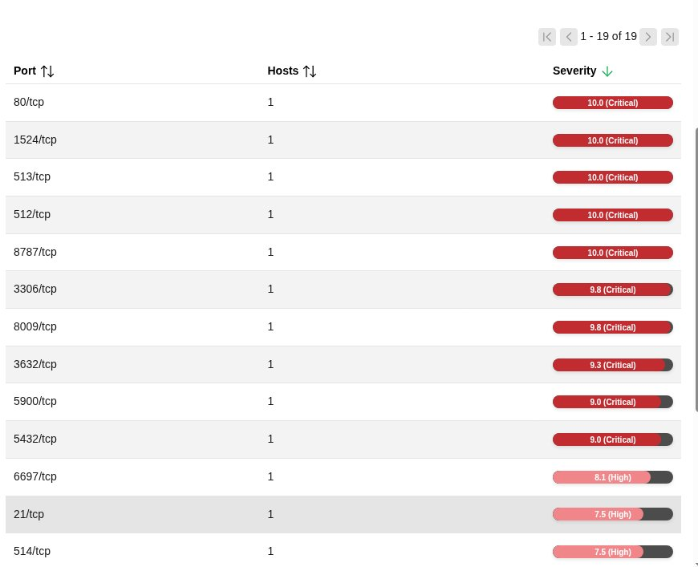

---

# MITRE ATT&CK Mapping

- T1595 – Vulnerability Scanning
- T1190 – Exploit Public-Facing Application
- T1059 – Command Shell
- T1003 – Credential Dumping
- T1110 – Password Guessing / Cracking
- T1083 – File Discovery

---

# Final Report Page

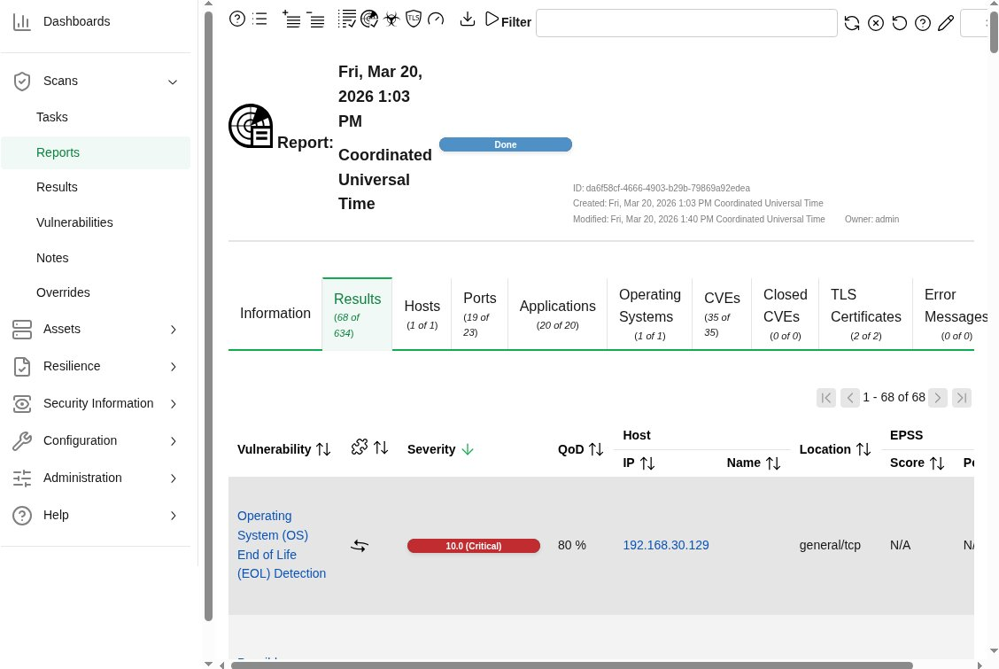

---

# Conclusion

This engagement successfully demonstrated:

Reconnaissance → Enumeration → Exploitation → Root Access → Credential Attack → Vulnerability Validation → Malware Testing

All activities were performed in an isolated VMware lab for authorized educational internship purposes.

---

# Files Included

- CyArt_Task06_RedTeaming_FINAL_Pretam.pdf
- Screenshots/
- README.md

---

# Author

**Pretam Saha**  
CyArt Tech LLP Cybersecurity Internship
EOF
