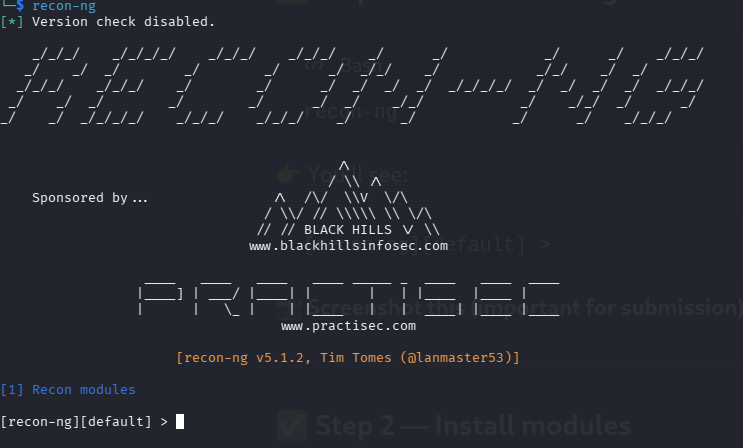
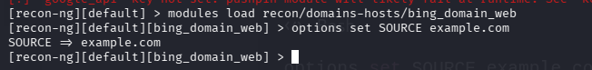
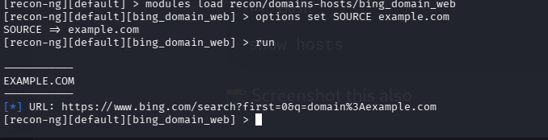
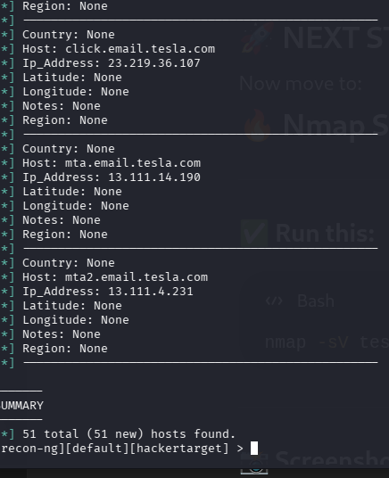
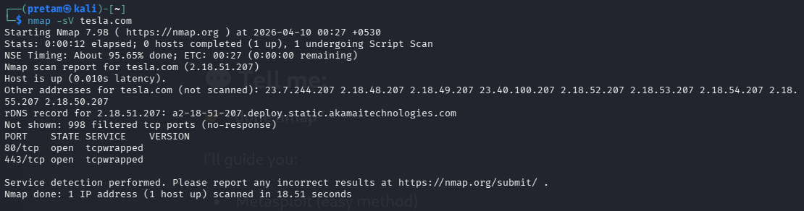
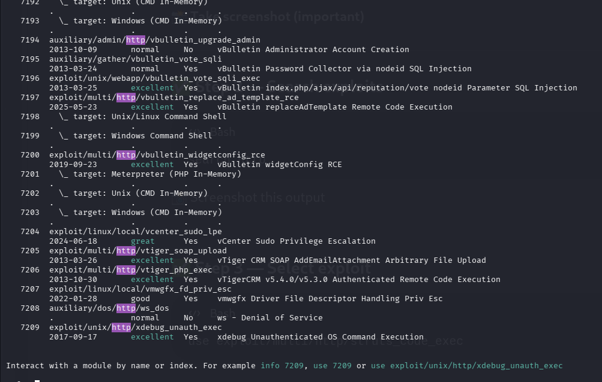

# 🔴 Week 3 - Red Team Assignment

## 📌 Objective

The objective of this assignment is to perform a simulated red team engagement including reconnaissance, scanning, and vulnerability analysis using industry-standard tools.

---

# 🧠 1. Theoretical Knowledge

## 🔍 Reconnaissance (OSINT)

Reconnaissance is the first phase of a cyber attack where information about the target is collected.

* **Passive Reconnaissance**: Gathering information without directly interacting with the target (WHOIS, DNS, Shodan).
* **Active Reconnaissance**: Direct interaction such as port scanning and service enumeration.

### Tools Used:

* Recon-ng
* Shodan

---

## 🔑 Initial Access

Initial access involves gaining entry into the target system.

* Phishing
* Credential attacks
* Exploiting exposed services

---

## 💥 Exploitation

This phase involves exploiting vulnerabilities such as:

* SQL Injection
* Cross-Site Scripting (XSS)
* Remote Code Execution (RCE)

---

## 🔄 Lateral Movement & Persistence

* Moving across systems using credentials
* Maintaining access using backdoors or scheduled tasks

---

## 🕵️ Evasion Techniques

* Obfuscation
* Proxy/VPN usage
* Masquerading as legitimate processes

---

# 🧪 2. Practical Implementation

## 🔍 Recon-ng (Subdomain Enumeration)

Recon-ng was used to gather subdomains of **tesla.com** using the hackertarget module.

### Steps:

```bash
recon-ng
modules load recon/domains-hosts/hackertarget
options set SOURCE tesla.com
run
```

### 📊 Results:

* Total Hosts Found: **51**
* Example:

  * tesla.com
  * accounts.tesla.com
  * auth.tesla.com

### 📸 Screenshots:





---

## 🌐 Nmap Scanning

Nmap was used to identify open ports and services.

### Command:

```bash
nmap -sV tesla.com
```

### 📊 Results:

| Port | Service | Description        |
| ---- | ------- | ------------------ |
| 80   | HTTP    | Web traffic        |
| 443  | HTTPS   | Secure web traffic |

### 📸 Screenshot:



---

## 💥 Metasploit (Exploitation Analysis)

Metasploit was used to analyze vulnerabilities.

### Steps:

```bash
msfconsole
search http
use exploit/multi/http/struts_code_exec
show options
```

### 📊 Findings:

* Struts RCE vulnerability identified
* CVSS Score: 9.8 (Critical)

### 📸 Screenshots:




---

# 📊 3. Findings

* Multiple subdomains discovered
* Open ports (80, 443)
* Web services protected by CDN (Akamai)
* Potential web vulnerabilities

---

# 🛡️ 4. Recommendations

* Regular patch updates
* Strong authentication mechanisms
* Network monitoring (IDS/IPS)
* Secure configuration of services

---

# ⚠️ Ethical Consideration

All activities were performed in a **controlled lab environment** for educational purposes only.
No real-world systems were exploited.

---

# ✅ Conclusion

This assignment demonstrated the complete red team workflow including reconnaissance, scanning, and vulnerability assessment. It highlights how attackers identify and analyze potential security weaknesses in systems.

---
